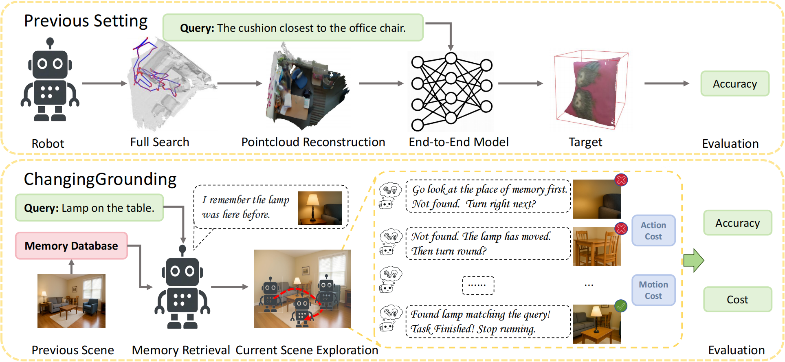

# Benchmark
<p align="center">
  
</p>


Traditional 3D visual grounding methods rely on complete 3D scene point clouds and assume static environments. However, these approaches face significant limitations when deployed in real-world robotic systems: real environments are dynamic. Robots must rescan the entire scene to reconstruct point clouds, which is costly; otherwise, they usually do not even know whether or where changes occurred. In contrast, humans use memories of past scenes to focus on likely areas and localize targets with only a few new observations. Inspired by this ability, we define a new task: memory-based 3D visual grounding in changing scenes. The system is given past scene observations, the current scene, and a user query. Its goal is to localize the target object efficiently and accurately. Performance is measured by both the accuracy of the predicted 3D bounding box and the cost of exploration.


## Good (H2)

### Nice (H3)

[**Diffusion models**](https://lilianweng.github.io/posts/2021-07-11-diffusion-models/) are a class of generative models in machine learning that have gained significant attention in recent years. 

**Text-to-image diffusion models** have various application scenarios, including:

- **Art & Design**: Used by artists for creative art and fashion designers to generate clothing renderings.
- **Advertising & Marketing**: Helps in creating advertising posters and product promotion maps.
- **Game & Film**: Applied in game scene and character design, as well as film and television concept design...

> Thegeneral training steps of diffusion models are as follows:

1. Data collection
2. Noise addition
3. Model building
4. Training
5. Evaluation
6. Deployment


```
import torch 

def denoise():
    pass
```

* [ ] to do
* [x] done
* [x] ~114514~


Lift ($$L$$) can be determined by Lift Coefficient ($$C_L$$) like the following
equation.

$$
L = \frac{1}{2} \rho v^2 S C_L
$$


### Table (H3)

| a       | b       | c     |  d      |
| -       | :-      | -:    | :-:     |
| Alpha   | Bravo   | Alpha | Bravo   |
| 中文    | Charlie | 👩‍❤️‍👩    | Delta   |
