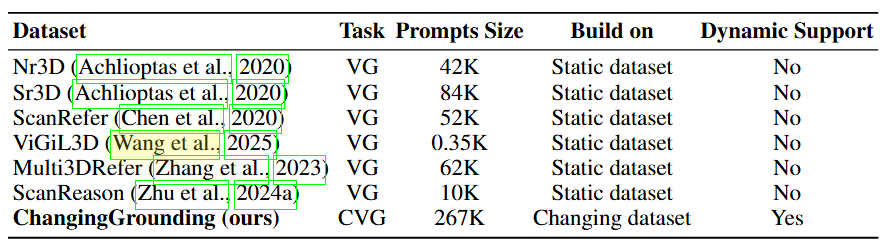

# ChangingGrounding Benchmark

  

Traditional 3D visual grounding methods rely on complete 3D scene point clouds and assume static environments. However, these approaches face significant limitations when deployed in real-world robotic systems: real environments are dynamic. Robots must rescan the entire scene to reconstruct point clouds, which is costly; otherwise, they usually do not even know whether or where changes occurred. In contrast, humans use memories of past scenes to focus on likely areas and localize targets with only a few new observations. Inspired by this ability, we define a new task: memory-based 3D visual grounding in changing scenes, the ChangingGrounding Benchmark. The system is given past scene observations, the current scene, and a user query. Its goal is to localize the target object efficiently and accurately. Performance is measured by both the accuracy of the predicted 3D bounding box and the cost of exploration.

  

To support this new task, we built the ChangingGrounding dataset, derived from 3RScan. It provides (1) spatial-relation queries of target objects, (2) RGB-D images with camera poses as memory, and (3) re-rendered frames for new observations. Compared with existing benchmarks, the ChangingGrounding dataset is quite big and the only one designed for changing environments.

