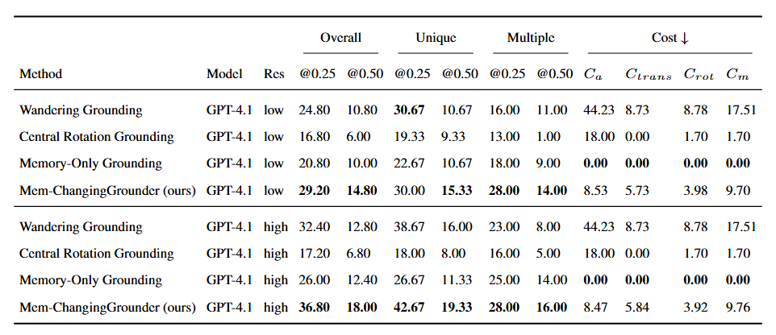

# Experiment Results

We compare our Mem-ChangingGrounder (MCG) with three baselines that cover two simplified scenarios, using only exploration without memory or using only memory without exploration. The first baseline, Wandering Grounding, corresponds to the original VLM-Grounder that uses all images and poses from the current scene. The second, Central Rotation Grounding, applies the VLM-Grounder to images captured by rotating at the initial pose of the scene. The third, Memory-Only Grounding, employs the VLM-Grounder but only with images from the previous scene as memory.

We conduct experiments in both low- and high-resolution settings. Results show that MCG achieves the best accuracy across both conditions, outperforming all three baselines by a clear margin. This demonstrates that MCG provides more robust and effective grounding while maintaining efficiency by leveraging memory before exploration.

  

